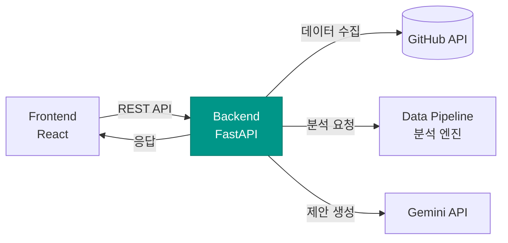

# OSS Health Checker — Backend

[](https://github.com/OpenSource-2026/oss-health-backend/actions/workflows/ci.yml)


> OSS Health Checker의 핵심 API 서버. GitHub 데이터 수집, 건강도 분석 파이프라인 실행, AI 리포트 생성을 오케스트레이션합니다.

---

## 시스템 내 위치



Backend는 프론트엔드의 요청을 받아 **GitHub API 데이터 수집 → 분석 파이프라인 실행 → AI 개선 제안 생성**까지의 전체 흐름을 조율하는 **오케스트레이션 레이어**입니다.

---

## 기술 스택

| 영역 | 기술 | 선택 이유 |
|------|------|-----------|
| Framework | FastAPI | 비동기 지원, 자동 API 문서 생성 (Swagger/Redoc), 타입 검증 |
| Language | Python 3.12 | Data Pipeline과 동일 언어로 통합 용이 |
| AI Report | Gemini API | 분석 결과 기반 맞춤형 개선 제안 생성 |
| Containerization | Docker + Compose | 프론트엔드/백엔드 통합 실행 환경 구성 |
| CI/CD | GitHub Actions | PR 단위 자동 린트, 테스트, 빌드 검증 |
| HTTP Client | httpx | GitHub API 비동기 호출 |
| Validation | Pydantic v2 | 요청/응답 스키마 정의 및 타입 안전성 보장 |

---

## 프로젝트 구조

```
oss-health-backend/
├── app/
│   ├── main.py                  # FastAPI 앱 진입점 (+ /metrics 노출)
│   ├── config.py                # 환경 변수 및 설정 관리 (키는 모두 선택)
│   ├── metrics.py               # Prometheus 커스텀 카운터 (진단/캐시)
│   ├── api/
│   │   ├── router.py            # API 라우터 통합
│   │   ├── oss_health.py        # POST /api/oss-health/diagnose — 진단 (메인)
│   │   └── v1/
│   │       └── health.py        # GET  /api/v1/health — 서버 상태 확인
│   ├── services/
│   │   ├── diagnosis_service.py # 분석 엔진(pipeline) 호출 + 샘플 fallback
│   │   ├── ai_report_service.py # Gemini 연동 (선택적 ai_report 생성)
│   │   └── github_service.py    # GitHub URL 파싱 유틸
│   ├── schemas/
│   │   └── diagnosis.py         # 진단 요청/응답 스키마 (데이터팀 계약)
│   ├── fixtures/
│   │   └── sample_diagnosis.json# 키 없을 때 쓰는 샘플 진단 (실제 엔진 출력)
│   └── utils/
│       ├── github_client.py     # GitHub API 비동기 HTTP 클라이언트
│       ├── rate_limiter.py      # GitHub API Rate Limit 핸들링
│       └── cache.py             # 진단 결과 TTL 캐시 (응답 캐싱)
├── pipeline/                    # 데이터팀 분석 엔진 (벤더링: 모델+추론 코드)
│   ├── inference/oss_health_diagnosis.py  # diagnose_repository()
│   ├── models/                  # 학습된 모델 + feature 메타데이터
│   └── ...
├── monitoring/                  # Prometheus 설정 + Grafana 대시보드/프로비저닝
├── tests/
│   ├── test_diagnose.py         # 진단 엔드포인트 테스트
│   ├── test_github_service.py   # URL 파싱 테스트
│   ├── test_health.py
│   └── test_rate_limiter.py
├── Dockerfile
├── docker-compose.yml
├── .github/workflows/ci.yml     # GitHub Actions CI/CD 파이프라인
├── requirements.txt
├── .env.example
└── README.md
```

---

## API 명세

> 분석 엔드포인트의 요청/응답 계약은 데이터 파이프라인 팀의 `pipeline/API_CONTRACT.md`를
> 따릅니다. 백엔드는 그 위에 얇은 오케스트레이션 레이어(샘플 fallback, 선택적 AI 리포트)일 뿐입니다.

### `POST /api/oss-health/diagnose`

GitHub 레포지토리 URL(또는 `owner/repo`)을 받아 학습된 모델로 건강도를 진단합니다.

**Request**

```json
{ "repo_url": "https://github.com/pallets/flask" }
```

**Response** (필드 일부 생략)

```json
{
  "repo_name": "pallets/flask",
  "overall_score": 99.87,
  "healthy_probability": 0.9987,
  "overall_grade": "Excellent",
  "model_name": "LogisticRegression",
  "target": "new_label",
  "source": "live",
  "dimension_scores": [
    {
      "dimension": "community_activity",
      "label": "커뮤니티 활성도",
      "score": 51.09,
      "grade": "Weak",
      "core_question": "이 프로젝트는 현재 살아 움직이고 있는가?",
      "concepts": "Activity Volume, Responsiveness, Engagement Quality",
      "summary": "커뮤니티 활성도 점수는 51.1점으로 개선이 필요하다.",
      "strength_features": [
        { "feature": "num_events", "label": "최근 활동량", "score": 100.0,
          "description": "최근 GitHub 이벤트가 많아 프로젝트 활동량이 높게 관찰됩니다." }
      ],
      "risk_features": [
        { "feature": "external_interest_event_ratio", "label": "외부 관심 이벤트 의존도",
          "score": 26.41, "description": "Watch/Fork 같은 외부 관심 이벤트에 비해 실제 상호작용이 부족할 수 있습니다." }
      ]
    }
  ],
  "ai_report": { "summary": "...", "strengths": ["..."], "improvements": ["..."] }
}
```

| 필드 | 설명 |
|------|------|
| `overall_score` / `overall_grade` | 모델 기반 종합 점수(0~100)와 등급 |
| `dimension_scores` | 5개 차원: `community_activity`, `sustainability`, `code_quality_reliability`, `legal_operational_governance`, `project_maturity` |
| `grade` | `Excellent` / `Good` / `Moderate` / `Weak` / `Risk` |
| `strength_features` / `risk_features` | 차원별 강점/위험 신호 (`feature`, `label`, `score`, `description`) |
| `source` | `live`(모델 실호출) 또는 `sample`(토큰 없음/GitHub 불가 시 fallback) |
| `ai_report` | **선택** — `GEMINI_API_KEY`가 있을 때만 포함 |

### `GET /api/v1/health`

서버 상태를 확인합니다.

**Response**

```json
{
  "status": "ok",
  "version": "0.1.0"
}
```

### `GET /metrics`

Prometheus 메트릭 노출 (스크레이프용). 기본 HTTP 메트릭 + 커스텀 카운터
(`oss_diagnose_total{source}`, `oss_cache_total{result}`)를 반환합니다.

---

## 관측성 & 캐싱

- **응답 캐싱**: 동일 레포 진단 결과를 1시간 캐시(`app/utils/cache.py`). 재요청 시
  GitHub API·모델 추론을 건너뛰어 즉시 응답(실측 ≈5s → ≈1ms). proposal §3.6의
  Rate Limit 대책(응답 캐싱)을 구현한 것으로, live 결과만 캐시하고 sample
  fallback은 캐시하지 않습니다.
- **모니터링**: `GET /metrics`(prometheus-fastapi-instrumentator) → Prometheus가
  수집 → Grafana 대시보드로 시각화. `docker compose up` 시 함께 기동되며
  **http://localhost:3001** 에서 요청률·지연(p50/p95)·캐시 히트율·진단 source
  분포를 실시간 확인할 수 있습니다. 설정은 `monitoring/` 참고.

---

## 실행 방법

### 사전 요구사항

- Python 3.12+
- Docker & Docker Compose (컨테이너 실행 시)
- GitHub Personal Access Token
- Gemini API Key

### 로컬 실행

```bash
# 1. 레포지토리 클론
git clone https://github.com/OpenSource-2026/oss-health-backend.git
cd oss-health-backend

# 2. 가상환경 생성 및 활성화
python -m venv venv
source venv/bin/activate  # Windows: venv\Scripts\activate

# 3. 의존성 설치
pip install -r requirements.txt

# 4. 환경 변수 설정
cp .env.example .env
# .env 파일에 API 키 입력

# 5. 서버 실행
uvicorn app.main:app --reload --port 8000
```

### Docker 실행

```bash
# 빌드 및 실행
docker-compose up --build

# 백그라운드 실행
docker-compose up -d --build
```

서버 실행 후 API 문서 확인:
- Swagger UI: `http://localhost:8000/docs`
- ReDoc: `http://localhost:8000/redoc`

---

## 환경 변수

| 변수명 | 설명 | 필수 |
|--------|------|------|
| `GITHUB_TOKEN` | GitHub PAT (API Rate Limit 확장). 없으면 unauth(60req/h)로 동작 | X |
| `GEMINI_API_KEY` | Gemini API 키 (선택적 AI 리포트). 없으면 `ai_report` 필드만 생략 | X |
| `CORS_ORIGINS` | 허용할 프론트엔드 Origin URL (default: localhost:3000) | X |
| `DEBUG` | 디버그 모드 활성화 (default: false) | X |

> 키가 하나도 없어도 서버는 정상 부팅되며, 진단은 `source: "sample"` fallback으로 동작합니다(데모 가능). 키를 채우면 `source: "live"` 실호출 + AI 리포트가 활성화됩니다.

---

## CI/CD 파이프라인


모든 PR은 위 파이프라인(`.github/workflows/ci.yml`)을 통과해야 머지할 수 있습니다.

---

## 관련 레포지토리

| 레포지토리 | 설명 |
|-----------|------|
| [oss-health-frontend](https://github.com/OpenSource-2026/oss-health-frontend) | React 프론트엔드 |
| [oss-health-data-pipeline](https://github.com/OpenSource-2026/oss-health-data-pipeline) | 건강도 분석 엔진 |

---

## 라이선스

[Apache License 2.0](LICENSE)
