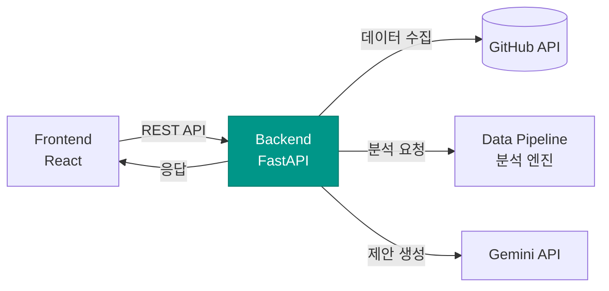

# OSS Health Checker — Backend


> OSS Health Checker의 핵심 API 서버. GitHub 데이터 수집, 건강도 분석 파이프라인 실행, AI 리포트 생성을 오케스트레이션합니다.

---

## 시스템 내 위치



Backend는 프론트엔드의 요청을 받아 **GitHub API 데이터 수집 → 분석 파이프라인 실행 → AI 개선 제안 생성**까지의 전체 흐름을 조율하는 **오케스트레이션 레이어**입니다.

---

## 기술 스택

| 영역 | 기술 | 선택 이유 |
|------|------|-----------|
| Framework | FastAPI | 비동기 지원, 자동 API 문서 생성 (Swagger/Redoc), 타입 검증 |
| Language | Python 3.12 | Data Pipeline과 동일 언어로 통합 용이 |
| AI Report | Gemini API | 분석 결과 기반 맞춤형 개선 제안 생성 |
| Containerization | Docker + Compose | 프론트엔드/백엔드 통합 실행 환경 구성 |
| CI/CD | GitHub Actions | PR 단위 자동 린트, 테스트, 빌드 검증 |
| HTTP Client | httpx | GitHub API 비동기 호출 |
| Validation | Pydantic v2 | 요청/응답 스키마 정의 및 타입 안전성 보장 |

---

## 프로젝트 구조

```
oss-health-backend/
├── app/
│   ├── main.py                 # FastAPI 앱 진입점
│   ├── config.py               # 환경 변수 및 설정 관리
│   ├── api/
│   │   ├── router.py           # API 라우터 통합
│   │   └── v1/
│   │       ├── analyze.py      # POST /api/v1/analyze — 분석 요청 처리
│   │       └── health.py       # GET  /api/v1/health  — 서버 상태 확인
│   ├── services/
│   │   ├── github_service.py   # GitHub API 데이터 수집 서비스
│   │   ├── analysis_service.py # Data Pipeline 연동 및 분석 오케스트레이션
│   │   └── ai_report_service.py# Gemini API 연동 및 리포트 생성
│   ├── schemas/
│   │   ├── request.py          # 요청 스키마 (AnalyzeRequest)
│   │   └── response.py         # 응답 스키마 (HealthReport, DimensionScore)
│   └── utils/
│       ├── github_client.py    # GitHub API 비동기 HTTP 클라이언트
│       └── rate_limiter.py     # GitHub API Rate Limit 핸들링
├── tests/
│   ├── test_analyze.py         # 분석 엔드포인트 테스트
│   └── test_github_service.py  # GitHub 데이터 수집 테스트
├── Dockerfile
├── docker-compose.yml
├── .github/
│   └── workflows/
│       └── ci.yml              # GitHub Actions CI/CD 파이프라인
├── requirements.txt
├── .env.example
└── README.md
```

---

## API 명세

### `POST /api/v1/analyze`

GitHub 레포지토리 URL을 받아 건강도를 분석합니다.

**Request**

```json
{
  "repo_url": "https://github.com/facebook/react"
}
```

**Response**

```json
{
  "repository": {
    "name": "react",
    "owner": "facebook",
    "url": "https://github.com/facebook/react",
    "stars": 48221,
    "forks": 19774,
    "language": "JavaScript"
  },
  "health_score": {
    "total": 82,
    "dimensions": {
      "community_activity": {
        "score": 91,
        "grade": "A",
        "details": {
          "activity_volume": 95,
          "responsiveness": 88,
          "engagement_quality": 90
        }
      },
      "sustainability": {
        "score": 78,
        "grade": "B",
        "details": {
          "contributor_structure": 72,
          "diversity": 81,
          "activity_stability": 80
        }
      },
      "code_quality": {
        "score": 85,
        "grade": "A",
        "details": {
          "engineering_practice": 90,
          "defect_signals": 82,
          "security_signals": 83
        }
      },
      "governance": {
        "score": 76,
        "grade": "B",
        "details": {
          "legal_compliance": 100,
          "governance_structure": 52
        }
      },
      "maturity": {
        "score": 80,
        "grade": "B",
        "details": {
          "release_engineering": 85,
          "adoption_popularity": 92,
          "lifecycle_scale": 63
        }
      }
    }
  },
  "ai_report": {
    "summary": "React는 전반적으로 건강한 오픈소스 프로젝트입니다...",
    "improvements": [
      "CONTRIBUTING.md 파일을 추가하여 외부 기여자의 참여를 유도하세요.",
      "최근 30일간 미응답 이슈 비율이 높습니다. 이슈 트리아지 프로세스를 도입하세요.",
      "릴리즈 주기가 불규칙합니다. 정기 릴리즈 일정을 수립하는 것을 권장합니다."
    ],
    "strengths": [
      "커밋 활동이 매우 활발하며 기여자 수가 풍부합니다.",
      "라이선스가 명확하게 명시되어 있습니다.",
      "CI/CD 파이프라인이 잘 구성되어 있습니다."
    ]
  }
}
```

### `GET /api/v1/health`

서버 상태를 확인합니다.

**Response**

```json
{
  "status": "ok",
  "version": "1.0.0"
}
```

---

## 실행 방법

### 사전 요구사항

- Python 3.12+
- Docker & Docker Compose (컨테이너 실행 시)
- GitHub Personal Access Token
- Gemini API Key

### 로컬 실행

```bash
# 1. 레포지토리 클론
git clone https://github.com/OpenSource-2026/oss-health-backend.git
cd oss-health-backend

# 2. 가상환경 생성 및 활성화
python -m venv venv
source venv/bin/activate  # Windows: venv\Scripts\activate

# 3. 의존성 설치
pip install -r requirements.txt

# 4. 환경 변수 설정
cp .env.example .env
# .env 파일에 API 키 입력

# 5. 서버 실행
uvicorn app.main:app --reload --port 8000
```

### Docker 실행

```bash
# 빌드 및 실행
docker-compose up --build

# 백그라운드 실행
docker-compose up -d --build
```

서버 실행 후 API 문서 확인:
- Swagger UI: `http://localhost:8000/docs`
- ReDoc: `http://localhost:8000/redoc`

---

## 환경 변수

| 변수명 | 설명 | 필수 |
|--------|------|------|
| `GITHUB_TOKEN` | GitHub Personal Access Token (API Rate Limit 확장) | O |
| `GEMINI_API_KEY` | Gemini API 키 (AI 리포트 생성) | O |
| `CORS_ORIGINS` | 허용할 프론트엔드 Origin URL | O |
| `DEBUG` | 디버그 모드 활성화 (default: false) | X |

---

## CI/CD 파이프라인


모든 PR은 위 파이프라인을 통과해야 머지할 수 있습니다.

---

## 관련 레포지토리

| 레포지토리 | 설명 |
|-----------|------|
| [oss-health-frontend](https://github.com/OpenSource-2026/oss-health-frontend) | React 프론트엔드 |
| [oss-health-data-pipeline](https://github.com/OpenSource-2026/oss-health-data-pipeline) | 건강도 분석 엔진 |

---

## 라이선스

[Apache License 2.0](LICENSE)
