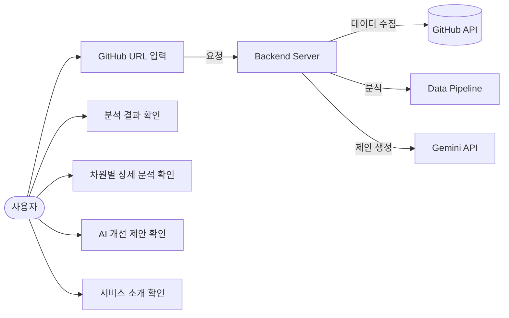
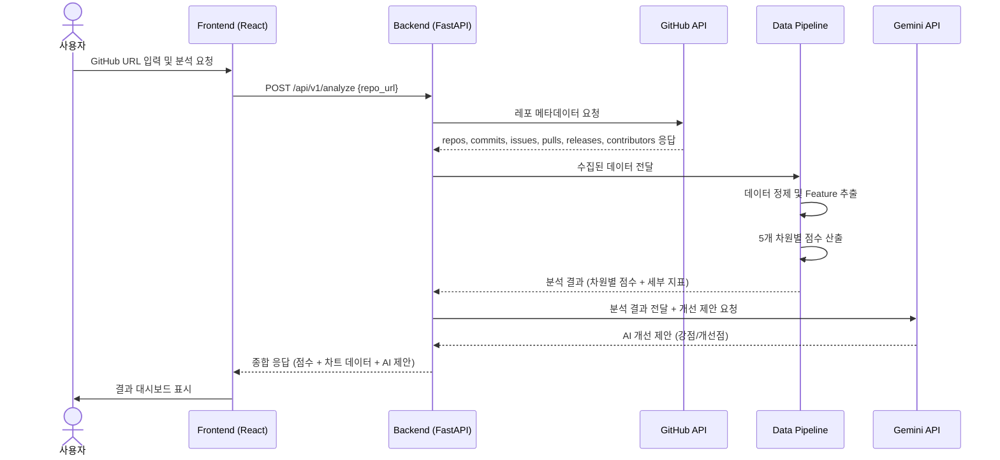
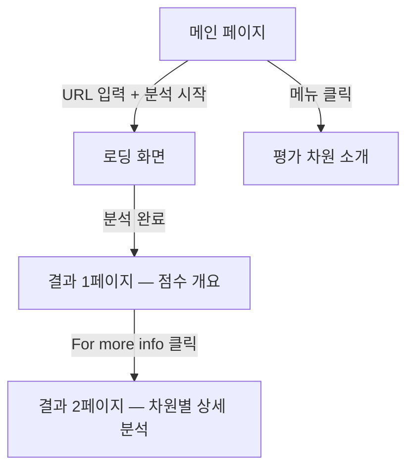
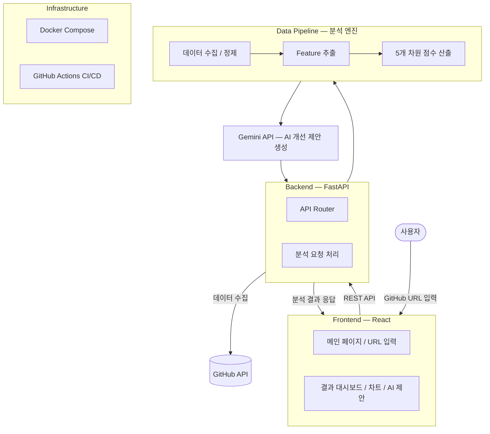

# OSS Health Checker — 팀 프로젝트 제안서

> GitHub 레포지토리의 오픈소스 건강도를 분석하고 개선점을 제안하는 웹 서비스

**과목명:** 오픈소스SW기초

**담당 교수:** 송인식 교수님

**팀원:** 김나경(팀장), 신바다, 강수빈, 한예준

---

## 1. 프로젝트 개요

### 1.1 배경

오픈소스 소프트웨어는 현대 소프트웨어 개발의 핵심 기반이 되었다. GitHub에만 수억 개의 레포지토리가 존재하며, 대부분의 상용 소프트웨어도 오픈소스 컴포넌트에 의존하고 있다.

그러나 오픈소스 프로젝트를 실제로 사용하거나 기여하려 할 때, 다음과 같은 문제에 직면한다.

| 문제 | 설명 |
|------|------|
| **프로젝트 상태 파악의 어려움** | 해당 프로젝트가 활발히 관리되고 있는지, 사실상 방치된 프로젝트인지 한눈에 판단하기 어렵다 |
| **평가 기준의 부재** | 어떤 기준으로 프로젝트의 품질과 건강성을 판단해야 하는지 명확하지 않다 |
| **수동 탐색 비용** | 커밋 기록, 이슈 응답 속도, PR 처리 현황, 라이선스, 기여자 구조 등을 하나하나 직접 확인해야 한다 |
| **개선 방향의 부재** | 오픈소스 관리자가 자기 프로젝트에서 무엇을 개선해야 하는지 객관적으로 파악하기 어렵다 |

이러한 문제들은 오픈소스의 "건강성(Health)"이라는 개념이 단순한 인기 지표(Star 수, Fork 수)로 환원될 수 없는, 다차원적 특성을 갖기 때문에 발생한다.

### 1.2 제안 내용

**OSS Health Checker**는 GitHub 레포지토리 URL을 입력하면, GitHub API를 통해 데이터를 자동 수집하고, **5가지 평가 차원**에서 건강도를 분석하여 **점수, 시각화 리포트, AI 기반 개선 제안**을 제공하는 웹 서비스이다.

#### 5가지 평가 차원

본 프로젝트의 건강성 평가 체계는 CHAOSS(Community Health Analytics in Open Source Software), ISO/IEC 25010(소프트웨어 품질 특성), ISO/IEC 5230(OpenChain, 오픈소스 컴플라이언스), Red Hat 오픈소스 성숙도 평가 등 국제적·산업적 기준에 기반하여 설계되었다.

| 평가 차원 | 핵심 질문 | 세부 개념 |
|-----------|-----------|-----------|
| **커뮤니티 활성도** | 이 프로젝트는 현재 살아 움직이고 있는가? | Activity Volume, Responsiveness, Engagement Quality |
| **지속 가능성** | 이 프로젝트는 앞으로도 유지될 수 있는가? | Contributor Structure, Diversity, Activity Stability |
| **코드 품질 및 신뢰성** | 이 프로젝트의 산출물은 믿을 수 있는가? | Engineering Practice, Defect Signals, Security Signals |
| **법적/운영 거버넌스** | 이 프로젝트는 조직적으로 안전하게 운영되는가? | Legal Compliance, Governance Structure |
| **프로젝트 성숙도** | 이 프로젝트는 성숙한 운영 체계를 갖추었는가? | Release Engineering, Adoption/Popularity, Lifecycle/Scale |

각 평가 차원은 세부 개념으로 분해되며, 세부 개념은 다시 GitHub API에서 실제로 측정 가능한 Feature로 환원된다. 이 3단 구조(평가 차원 → 세부 개념 → 측정 Feature)를 통해 추상적인 "건강성" 개념을 정량적으로 평가할 수 있다.

#### 측정 Feature 상세

| 평가 차원 | 세부 개념 | 측정 Feature | Feature 설명 | 논리적 근거 |
|-----------|-----------|-------------|-------------|-------------|
| 커뮤니티 활성도 | Activity Volume | commit_count, commit_frequency, PR_count, issue_count, contributor_count | 프로젝트 기여량과 활동 수준을 직접적으로 반영 | CHAOSS 기본 vitality 지표 |
| 커뮤니티 활성도 | Responsiveness | issue_response_time, PR_merge_time, issue_close_rate, review_count | 커뮤니티 상호작용 속도 및 유지보수 효율성 반영 | 활발한 커뮤니티는 문제와 기여에 빠르게 반응함 |
| 커뮤니티 활성도 | Engagement Quality | comment_count, unique_commenters, reopened_issue_rate | 단순 활동량이 아닌 의미 있는 논의와 참여 구조를 측정 | 건강한 커뮤니티는 상호작용의 질이 높음 |
| 지속 가능성 | Contributor Structure | bus_factor, top_contributor_ratio, contributor_gini | 특정 개인 의존도와 기여 편중 정도 측정 | 특정 소수에 과도하게 의존할수록 지속 가능성이 낮음 |
| 지속 가능성 | Diversity | new_contributor_ratio, returning_contributor_ratio, organization_count | 신규 참여 유입과 참여 주체의 다양성 측정 | 다양한 참여자 기반은 장기 생존 가능성을 높임 |
| 지속 가능성 | Activity Stability | commit_variance, inactive_period_length, release_gap | 활동의 지속성, 공백, 불규칙성 측정 | 지속 가능성은 평균 활동량보다 안정성에 더 크게 좌우됨 |
| 코드 품질 및 신뢰성 | Engineering Practice | CI_exist, test_directory_exist, coverage_badge_exist, build_success_rate | 테스트·검증·자동화 등 개발 프로세스 성숙도 반영 | ISO/IEC 25010 maintainability 연계 |
| 코드 품질 및 신뢰성 | Defect Signals | bug_label_ratio, issue_fix_time, reopened_PR_rate | 결함 발생과 수정 효율성 측정 | 품질이 높은 프로젝트일수록 결함 관리가 체계적 |
| 코드 품질 및 신뢰성 | Security Signals | security_policy_exist, vulnerability_alert_count | 보안 대응 및 취약점 관리 수준 측정 | 신뢰 가능한 프로젝트는 보안 관리 체계를 가짐 |
| 법적/운영 거버넌스 | Legal Compliance | license_exist, license_type, SPDX_id | 라이선스 존재와 법적 명확성 측정 | OpenChain 관점에서 필수 요소 |
| 법적/운영 거버넌스 | Governance Structure | CODE_OF_CONDUCT_exist, CONTRIBUTING_exist, maintainer_count, roadmap_exist | 운영 규칙, 기여 규범, 유지보수 구조 존재 여부 측정 | 거버넌스 문서가 있을수록 조직적 운영 가능성이 높음 |
| 프로젝트 성숙도 | Release Engineering | release_frequency, semantic_versioning_usage, prerelease_ratio | 릴리즈 운영 체계와 버전 관리 성숙도 평가 | 성숙한 프로젝트일수록 릴리즈 체계가 명확 |
| 프로젝트 성숙도 | Adoption/Popularity | star_growth_rate, fork_growth_rate, watcher_count, dependency_count | 프로젝트 수용도와 생태계 확장성 측정 | 널리 채택된 프로젝트는 상대적으로 성숙도가 높음 |
| 프로젝트 성숙도 | Lifecycle/Scale | repo_age, codebase_size, branch_count | 프로젝트 규모, 이력, 운영 범위 평가 | 장기간 운영되며 구조가 축적된 프로젝트일수록 성숙 가능성이 높음 |

### 1.3 기대 효과

| 항목 | 기대 효과 |
|------|-----------|
| **오픈소스 품질 평가** | 프로젝트 관리 상태를 객관적 수치로 확인 가능. Star 수 같은 단편적 지표가 아닌 다차원 분석 제공 |
| **오픈소스 교육** | "좋은 오픈소스란 무엇인가"를 데이터 기반으로 학습할 수 있는 도구. 오픈소스SW기초 수업의 본질과 직결 |
| **관리자 지원** | AI 개선 제안으로 오픈소스 관리자가 자기 프로젝트의 부족한 점을 구체적으로 파악하고 개선 가능 |
| **실무 경험** | Git 협업, FastAPI, React, Docker, CI/CD 등 현업에서 사용하는 기술 스택을 실제 프로젝트에 적용 |
| **오픈소스 기여 문화** | 분석 결과를 바탕으로 오픈소스 프로젝트에 실질적인 기여(문서 개선, 이슈 응답 등)를 할 수 있는 인사이트 제공 |

### 1.4 기존 도구와의 차별점

| 항목 | 기존 도구 (GitHub Insights 등) | OSS Health Checker |
|------|------|------|
| 분석 방식 | 단순 수치 나열 | 5개 차원 × 14개 세부 개념 기반 다차원 점수화 |
| 평가 근거 | 없음 | CHAOSS, ISO/IEC 25010, OpenChain 등 국제 기준 기반 |
| 개선 제안 | 없음 | AI(Gemini) 기반 맞춤형 개선 방안 제시 |
| 시각화 | 제한적 | 차트 기반 직관적 리포트 (레이더 차트, 바 차트 등) |
| 배포 | — | Docker Compose로 누구나 실행 가능 |

---

## 2. 제공 기능

### 2.1 핵심 기능 목록

| 기능 | 설명 | 우선순위 |
|------|------|----------|
| **레포지토리 분석** | GitHub URL 입력 → 5개 차원 건강도 점수 산출 | 필수 |
| **결과 대시보드** | 종합 점수, 차원별 점수, 등급을 차트로 시각화 | 필수 |
| **AI 개선 제안** | 분석 결과를 기반으로 Gemini API가 구체적 개선 방안 생성 | 필수 |
| **차원별 상세 분석** | 각 평가 차원(활성도, 지속 가능성 등)의 세부 지표 상세 확인 | 필수 |
| **프로젝트 소개 페이지** | 서비스 소개, 5개 평가 차원 설명 | 필수 |

### 2.2 유스케이스 다이어그램



### 2.3 사용자 시나리오

#### 시나리오 1: 오픈소스 프로젝트 건강도 분석

> **사용자:** 오픈소스 프로젝트를 도입하려는 개발자

1. 사용자가 OSS Health Checker 메인 페이지에 접속한다.
2. 분석하고 싶은 GitHub 레포지토리 URL을 입력한다. (예: `https://github.com/facebook/react`)
3. "분석 시작" 버튼을 클릭한다.
4. 로딩 화면이 표시되며, 백엔드에서 GitHub API 데이터 수집 및 분석이 진행된다.
5. 분석이 완료되면 결과 대시보드로 이동한다.
6. 대시보드에서 다음을 확인한다:
   - **종합 건강도 점수** (0~100점) 및 등급 (A/B/C/D/F)
   - **5개 차원별 점수** — 레이더 차트로 시각화
   - **차원별 세부 지표** — 각 차원을 클릭하면 세부 개념별 점수 확인
   - **AI 개선 제안** — Gemini가 생성한 구체적 개선 방안 (강점 / 개선점)
7. 사용자는 분석 결과를 바탕으로 해당 오픈소스의 도입 여부를 판단한다.

#### 시나리오 2: 오픈소스 관리자의 프로젝트 진단

> **사용자:** 자기 오픈소스 프로젝트를 관리하는 개발자

1. 자기 레포지토리 URL을 입력하여 분석한다.
2. 결과 대시보드에서 부족한 차원을 확인한다. (예: 거버넌스 점수가 낮음)
3. AI 개선 제안에서 구체적 조치를 확인한다. (예: "CONTRIBUTING.md 파일을 추가하세요")
4. 제안에 따라 프로젝트를 개선한다.

### 2.4 시퀀스 다이어그램



### 2.5 화면 구성

#### 메인 페이지 (강수빈 담당)

| 구성 요소 | 설명 |
|-----------|------|
| 서비스 이름 및 한줄 소개 | OSS Health Checker의 목적을 직관적으로 전달 |
| URL 입력 폼 | GitHub 레포지토리 URL을 입력하는 입력창 + 분석 시작 버튼 |
| 로딩 화면 | 분석 진행 중 상태 표시 |
| 5개 평가 차원 소개 | 스크롤 시 각 평가 차원(커뮤니티 활성도, 지속 가능성 등)에 대한 설명 표시 |

메인 페이지는 두 가지 레이아웃을 검토하였으며, **상단 메뉴바 + 사이드바 네비게이션 방식**을 채택하였다. 사용자는 상단 메뉴에서 각 평가 차원의 세부 설명으로 바로 이동할 수 있으며, 사이드바에서도 URL을 입력할 수 있는 구조이다.

#### 결과 대시보드 (한예준 담당)

결과 화면은 **2페이지 구성**으로, 첫 페이지에서 수치적 개요를, 두 번째 페이지에서 차원별 상세 분석을 제공한다.

**결과 1페이지 — 점수 개요**

| 구성 요소 | 설명 |
|-----------|------|
| 상단 메뉴바 | OSHC 로고 + "OpenSource" 메뉴 + Login/Menu 버튼 |
| 레포지토리 URL 표시 | 메뉴바 하단 좌측에 분석 대상 오픈소스 주소 표시 |
| 레이더 차트 (좌측) | 5각 방사형 차트. 꼭지점: A(활성도), S(지속성), Q(품질/신뢰성), G(거버넌스), M(성숙도) |
| Average Score (우측 상단) | 종합 건강도 점수를 크게 표시 |
| 차원별 개별 점수 (우측 하단) | 5개 평가 차원 점수를 3개 + 2개 그리드로 배치. 각 점수는 색상으로 등급 표시 |
| 상세 보기 버튼 (하단 중앙) | 화살표 아이콘, hover 시 "For more info" 툴팁, 클릭 시 2페이지로 이동 |

**결과 2페이지 — 차원별 상세 분석**

| 구성 요소 | 설명 |
|-----------|------|
| 차원별 상세 카드 (3+2 배치) | 5개 평가 차원 각각에 대해 점수 범위에 해당하는 상세 설명 문구를 카드 형태로 표시. 상단 3개 + 하단 2개 배치 |
| AI 개선 제안 영역 | 강점(Positive Signals)과 개선점(Negative Signals)을 구분하여 표시 |

**점수 색상 기준**

| 등급 | 점수 범위 | 색상 | 설명 |
|------|-----------|------|------|
| 최고점 | 95 ~ 100 | 🔵 Blue | 매우 우수 |
| 성공적 | 71 ~ 94 | 🟢 Green | 양호 |
| 보안 권장 | 40 ~ 70 | 🟡 Yellow | 개선 필요 |
| 빈약 | 0 ~ 39 | 🔴 Red | 심각한 개선 필요 |

> 점수 구간은 분석 엔진의 점수화 로직 완성 후 유명 오픈소스 검증을 거쳐 최종 확정 예정

**타이포그래피**

| 용도 | 크기 | 굵기 |
|------|------|------|
| Heading | 24px | Bold |
| Subheading | 18px | Medium |
| Body | 14px | Regular |
| Caption | 12px | Light |

#### 화면 흐름



### 2.6 API 명세

#### `POST /api/v1/analyze`

GitHub 레포지토리 URL을 받아 건강도를 분석하고 결과를 반환한다.

**요청 (Request)**

```json
{
  "repo_url": "https://github.com/facebook/react"
}
```

**응답 (Response)**

```json
{
  "repository": {
    "name": "react",
    "owner": "facebook",
    "url": "https://github.com/facebook/react",
    "stars": 48221,
    "forks": 19774,
    "language": "JavaScript"
  },
  "health_score": {
    "total": 82,
    "grade": "A",
    "dimensions": {
      "community_activity": {
        "score": 91,
        "grade": "A",
        "details": {
          "activity_volume": 95,
          "responsiveness": 88,
          "engagement_quality": 90
        }
      },
      "sustainability": {
        "score": 78,
        "grade": "B",
        "details": {
          "contributor_structure": 72,
          "diversity": 81,
          "activity_stability": 80
        }
      },
      "code_quality": {
        "score": 85,
        "grade": "A",
        "details": {
          "engineering_practice": 90,
          "defect_signals": 82,
          "security_signals": 83
        }
      },
      "governance": {
        "score": 76,
        "grade": "B",
        "details": {
          "legal_compliance": 100,
          "governance_structure": 52
        }
      },
      "maturity": {
        "score": 80,
        "grade": "B",
        "details": {
          "release_engineering": 85,
          "adoption_popularity": 92,
          "lifecycle_scale": 63
        }
      }
    }
  },
  "ai_report": {
    "summary": "React는 전반적으로 건강한 오픈소스 프로젝트입니다.",
    "strengths": [
      "커밋 활동이 매우 활발하며 기여자 수가 풍부합니다.",
      "라이선스가 명확하게 명시되어 있습니다.",
      "CI/CD 파이프라인이 잘 구성되어 있습니다."
    ],
    "improvements": [
      "CONTRIBUTING.md 파일을 추가하여 외부 기여자의 참여를 유도하세요.",
      "최근 30일간 미응답 이슈 비율이 높습니다. 이슈 트리아지 프로세스를 도입하세요.",
      "릴리즈 주기가 불규칙합니다. 정기 릴리즈 일정을 수립하는 것을 권장합니다."
    ]
  }
}
```

#### `GET /api/v1/health`

서버 상태를 확인한다.

```json
{
  "status": "ok",
  "version": "1.0.0"
}
```

---

## 3. 개발 전략

### 3.1 시스템 아키텍처



### 3.2 기술 스택

| 영역 | 기술 | 선택 이유 |
|------|------|-----------|
| Frontend | React, Tailwind CSS, Chart.js | 컴포넌트 기반 UI, 유틸리티 CSS, 차트 시각화에 적합 |
| Backend | Python, FastAPI | 비동기 지원, 자동 API 문서 생성(Swagger), 타입 검증(Pydantic) |
| Data Pipeline | Python, GitHub REST API | GitHub 공식 API로 신뢰성 높은 데이터 수집, Python으로 분석 로직 구현 |
| AI Report | Gemini API | 분석 결과 기반 자연어 개선 제안 생성 |
| Infra | Docker, Docker Compose | 프론트엔드/백엔드 통합 실행 환경, 누구나 동일 환경에서 실행 가능 |
| CI/CD | GitHub Actions | PR 단위 자동 린트, 테스트, 빌드 검증 |
| Version Control | Git, GitHub | Organization 레포지토리로 팀 협업 |

### 3.3 레포지토리 구조

| 레포지토리 | 설명 | 담당 |
|-----------|------|------|
| [oss-health-frontend](https://github.com/OpenSource-2026/oss-health-frontend) | React 프론트엔드 | 강수빈, 한예준 |
| [oss-health-backend](https://github.com/OpenSource-2026/oss-health-backend) | FastAPI 백엔드 서버 | 신바다 |
| [oss-health-data-pipeline](https://github.com/OpenSource-2026/oss-health-data-pipeline) | 건강도 분석 엔진 | 김나경 |

### 3.4 역할 분담

| 팀원 | 역할 | 담당 내용 |
|------|------|-----------|
| **김나경** (팀장) | Data Pipeline | 건강도 평가 지표 체계 설계 (5개 차원 × 14개 세부 개념), GitHub API 데이터 수집 모듈 개발, Feature Selection 파이프라인 구현, 점수화 알고리즘 설계 및 구현 |
| **신바다** | Backend + DevOps | FastAPI 백엔드 서버 개발, API 설계, Docker + Docker Compose 구성, GitHub Actions CI/CD 파이프라인 구축, 프론트엔드/백엔드/분석엔진 시스템 통합, Gemini API 연동 |
| **강수빈** | Frontend (메인) | 메인 페이지 (URL 입력 폼, 로딩 화면), 프로젝트 소개 페이지, 5개 평가 차원 소개 화면, 사이드바 네비게이션 |
| **한예준** | Frontend (결과) | 결과 대시보드 페이지, 종합 점수 카드 및 등급 표시, Chart.js 차트 시각화 (레이더 차트, 바 차트), AI 개선 제안 표시 영역, 차원별 상세 분석 화면 |

### 3.5 개발 일정

| 주차 | 기간 | Backend (신바다) | Data Pipeline (김나경) | Frontend 메인 (강수빈) | Frontend 결과 (한예준) |
|------|------|------------------|----------------------|---------------------|---------------------|
| 1~2주 | 4/7 ~ 4/20 | 프로젝트 구조 세팅, FastAPI 뼈대, Docker 초기 구성 | Feature Selection 완료, GitHub API 데이터 수집 모듈 개발 | React 프로젝트 세팅, Tailwind 학습, 메인 페이지 와이어프레임 | React 학습, Chart.js 학습, 결과 페이지 와이어프레임 |
| 3~4주 | 4/21 ~ 5/4 | API 엔드포인트 구현, Gemini API 연동 | 점수화 알고리즘 설계 및 구현 | 메인 페이지 구현 (URL 입력 폼, 로딩 화면) | 결과 대시보드 구현 (mock 데이터 기반) |
| 5~6주 | 5/5 ~ 5/18 | Backend-Pipeline 연동, CI/CD 파이프라인 구축 | 점수화 로직 튜닝, 테스트 레포로 검증 | 평가 차원 소개 페이지, 사이드바 네비게이션 | Chart.js 차트 구현 (레이더, 바 차트), AI 제안 표시 영역 |
| 7~8주 | 5/19 ~ 6/1 | 프론트-백엔드 연동, Docker Compose 통합, 전체 시스템 테스트 | 최종 점수 검증, 분석 결과 품질 확인 | 실제 API 연동, UI 다듬기, 반응형 | 실제 API 연동, 차원별 상세 분석 화면 |
| 9~10주 | 6/2 ~ 6/15 | 버그 수정, 최종 배포, 발표 준비 | 발표 자료 데이터 준비 | 최종 UI 점검, 발표 시연 화면 | 최종 차트 점검, 발표 자료 |

### 3.6 위험 요인 및 대책

| 위험 요인 | 발생 가능성 | 영향도 | 대책 |
|-----------|------------|--------|------|
| **GitHub API Rate Limit** | 높음 | 높음 | Personal Access Token 사용 (시간당 5,000회), 응답 캐싱으로 중복 요청 방지 |
| **분석 시간 지연** | 중간 | 중간 | GitHub API 비동기 호출(httpx async), 로딩 UI로 사용자 경험 보완 |
| **프론트-백 연동 이슈** | 중간 | 중간 | API 응답 JSON 스키마를 초기에 확정하여 mock 데이터로 독립 개발, CORS 설정 사전 적용 |
| **팀원 간 기술 수준 차이** | 높음 | 중간 | 역할을 독립 모듈로 분리하여 각자 수준에 맞는 작업 배정, mock 데이터 제공으로 의존성 최소화 |
| **Gemini API 장애** | 낮음 | 낮음 | AI 제안은 부가 기능으로 분리. API 장애 시에도 점수 분석 결과는 정상 표시 |
| **점수화 기준의 주관성** | 중간 | 중간 | CHAOSS, ISO 등 국제 기준에 근거하여 설계, 유명 오픈소스(React, Django 등)로 결과 검증 |

### 3.7 성공 여부 판별 기준

| 기준 | 구체적 조건 |
|------|------------|
| **핵심 기능 완성** | GitHub URL 입력 → 5개 차원 점수 산출 → 결과 대시보드 표시 → AI 개선 제안 표시까지의 전체 흐름이 정상 동작 |
| **분석 정확성** | React, Django, Linux 등 유명 오픈소스를 분석했을 때 납득 가능한 점수가 산출됨 |
| **시각화 품질** | 레이더 차트, 바 차트가 정상적으로 렌더링되고, 점수에 따라 동적으로 변화함 |
| **AI 제안 유용성** | Gemini가 생성한 개선 제안이 분석 결과와 일관되고 구체적이며 실행 가능한 수준 |
| **배포 가능성** | Docker Compose로 `docker-compose up` 한 번에 전체 서비스가 실행됨 |
| **협업 프로세스** | GitHub Organization에서 3개 레포지토리로 분리 개발, PR 기반 코드 리뷰, CI/CD 파이프라인 자동 검증 |

---

## 4. 용어 설명 및 참고 문헌

### 4.1 용어 설명

| 용어 | 설명 |
|------|------|
| **오픈소스 (Open Source)** | 소스 코드가 공개되어 누구나 열람, 사용, 수정, 배포할 수 있는 소프트웨어 |
| **GitHub API** | GitHub에서 제공하는 REST API로, 레포지토리 정보, 커밋, 이슈, PR 등의 데이터를 프로그래밍 방식으로 조회 가능 |
| **건강도 (Health)** | 오픈소스 프로젝트의 활성도, 지속 가능성, 품질, 거버넌스, 성숙도를 종합적으로 평가한 지표 |
| **CHAOSS** | Community Health Analytics in Open Source Software. Linux Foundation 산하 프로젝트로, 오픈소스 커뮤니티 건강성 측정 지표를 정의하는 국제 표준 |
| **Bus Factor** | 프로젝트에서 핵심 기여자가 빠졌을 때 프로젝트가 멈출 위험도. 값이 낮을수록 특정 인물에 대한 의존도가 높음 |
| **Feature** | 건강도 평가에 사용되는 개별 측정 항목 (예: commit_count, issue_response_time 등) |
| **Rate Limit** | GitHub API의 호출 횟수 제한. 인증 없이 시간당 60회, Token 사용 시 시간당 5,000회 |
| **CI/CD** | Continuous Integration / Continuous Deployment. 코드 변경 시 자동으로 테스트, 빌드, 배포하는 파이프라인 |
| **Docker Compose** | 여러 Docker 컨테이너를 하나의 설정 파일로 정의하고 동시에 실행하는 도구 |
| **FastAPI** | Python 기반 비동기 웹 프레임워크. 자동 API 문서 생성(Swagger UI)과 Pydantic 타입 검증을 지원 |
| **Pydantic** | Python의 데이터 검증 라이브러리. API 요청/응답의 스키마를 정의하고 타입 안전성을 보장 |
| **Gemini API** | Google에서 제공하는 생성형 AI API. 텍스트 기반 분석 및 자연어 응답 생성에 활용 |
| **레이더 차트 (Radar Chart)** | 여러 지표를 방사형으로 배치하여 한눈에 비교할 수 있는 차트. 다차원 데이터 시각화에 적합 |
| **Gini 계수** | 불평등도를 측정하는 지표. 본 프로젝트에서는 기여자 간 커밋 분포의 편중 정도를 측정하는 데 활용 |
| **SPDX** | Software Package Data Exchange. 소프트웨어 라이선스 정보를 표준화된 형식으로 표현하는 규격 |

### 4.2 참고 문헌

1. **CHAOSS Project** — Community Health Analytics in Open Source Software
   - https://chaoss.community/
   - 오픈소스 커뮤니티 건강성 측정 지표 정의

2. **ISO/IEC 25010:2011** — Systems and software engineering — Systems and software Quality Requirements and Evaluation (SQuaRE)
   - 소프트웨어 품질 특성 모델 (유지보수성, 신뢰성 등)

3. **ISO/IEC 5230:2020 (OpenChain Specification)**
   - 오픈소스 라이선스 컴플라이언스 국제 표준

4. **GitHub REST API Documentation**
   - https://docs.github.com/en/rest
   - 레포지토리, 커밋, 이슈, PR, 릴리즈 등 데이터 수집 API

5. **Google Gemini API Documentation**
   - https://ai.google.dev/docs
   - AI 기반 텍스트 생성 API

6. **FastAPI Documentation**
   - https://fastapi.tiangolo.com/
   - Python 비동기 웹 프레임워크

7. **Chart.js Documentation**
   - https://www.chartjs.org/docs/
   - JavaScript 차트 시각화 라이브러리

8. **Red Hat — Understanding Open Source Project Health**
   - 오픈소스 프로젝트 운영 성숙도 평가 사례

---

## 부록: Data Pipeline Feature Selection 과정

본 프로젝트의 분석 엔진은 GitHub API의 원시 데이터를 그대로 사용하는 것이 아니라, 오픈소스 건강도 분석에 유의미한 Raw Signal만을 체계적으로 선별하는 과정을 거친다.

### Feature Selection 10단계 프로세스

| Step | 방법 | 핵심 로직 | 목적 | 산출물 |
|------|------|-----------|------|--------|
| 1 | Analysis Scope Definition | 건강도 지표와 관련 있는 GitHub endpoint만 선정 | 분석 Domain Boundary 설정 | 분석 대상 endpoint set |
| 2 | Full Schema Inventory | 각 endpoint 응답 JSON을 재귀적으로 탐색하여 모든 key path flatten | Feature 후보 Universe 생성 | 전체 key inventory |
| 3 | Feature Scoring | Relevance / Measurability / Noise 기준으로 key 점수화 | 분석 신호 vs 구조 노이즈 1차 분리 | drop / candidate / review 그룹 |
| 4 | Structural Hard Pruning | URL, avatar, node_id 등 API 구조용 필드 제거 | 분석과 무관한 메타 정보 제거 | 후보 feature 축소 |
| 5 | Text Noise Removal | body, description 등 자유서술 텍스트 제거 | 정형 Feature 중심 설계 | NLP 의존성 제거 |
| 6 | High Cardinality String Filtering | sha, ref, title 등 레포 고유 문자열 제거 | 일반화 가능한 Feature만 유지 | 범주형 신호 유지 |
| 7 | Measurement Axis Filtering | timestamp, count, contributor identity, workflow state 중심 유지 | 실제 Feature Engineering 가능한 축만 유지 | Measurement Feature Set |
| 8 | Endpoint Redundancy Removal | 동일 신호가 여러 endpoint에 존재하면 Primary source만 유지 | Feature 중복 및 lineage 혼란 방지 | 정제된 Feature Pool |
| 9 | Feature Family Mapping | Activity / Responsiveness / Sustainability / Governance / Popularity로 재분류 | Modeling 목적 기반 구조화 | Feature Family 구조 |
| 10 | Time-Series Generation Scoring | 시간 anchor 및 집계 가능 신호만 최종 선별 | Repo-level Time-Series Modeling 가능성 확보 | Core Raw Signal Set |

이 과정을 통해 GitHub API의 수백 개 필드에서 **최종 72개의 Core Raw Signal**이 선별되었으며, 이는 5개 평가 차원의 점수 산출에 직접 활용된다.

> Feature Selection 코드 및 상세 실험 기록: https://github.com/carolyn0515/repo-feature-mining-lab
